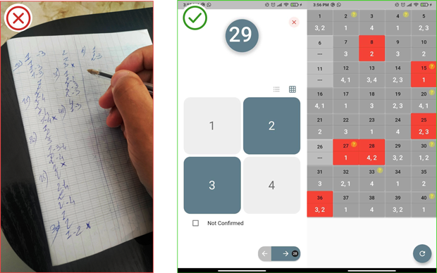

# Franni

If you are tired from writing down your answers on the papers manually during learning driving lessons.
If you want to try something new and more efficient that makes you focus more on the learning processes rather than destructive stuff,
We put on your hand this application that mimics the traditional way, with the benefits of clarity on design and smooth user experience

> The application logic only toke in count the Moroccan program.

The traditional way **VS.** With the help of the app

### To-dos:
- [ ] Program scans a photo that holds data in form of a table and extracts the data inside this task will facilitate the process of correction.
- [ ] Tracking the progress and display graphs
- [ ] Integrated method of taking notes
